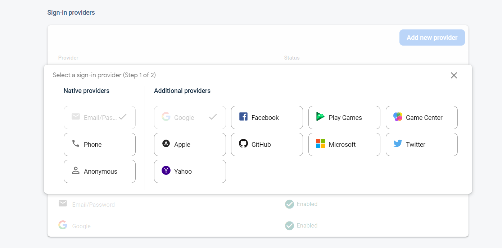

I have been using `Firebase` for a few years now, it's a great service Let's see how this Techstack supercharges my workflow and all the service it provides.

## Solo developers & Typical stack

Regardless of language and framework a typical stack will have a front end + rest API as back end,
implementing such a stack will be a big task, As a solo developer/freelancer you have to think about both business and development aspects of the software.

## My OG go-to stack 😎

- Front end
  - `React`
- Back end
  - `Express + MongoDB / MySQL` (based on the project)
These are all pretty solid technology there is nothing wrong with them. but... Let's see.

## React 

I love the component-based aspect and every other thing about `React`. but it doesn't care about SEO. Your entire application bundle is downloaded to the browser before it gets rendered in the browser.

This approach has few trade-offs let's focus on the below one.

- SEO

## Client-side Rendered (CSR) App = Bad SEO 🔎

Usually, search engines rank your web application/page based on various aspects one of them is the content of the page (heading tags, etc. ).

in the case of `React` application search engines will only see an empty div with root as id so the search engines will no idea about the content.

## SSR in react 🏋️‍♀️

Yes, we can customize the `React` setup to do server-side rendering (works well with express) you can do almost anything SSR as you do in CSR. the catch is you have to do a lot of code and work to make SSR work. even you may face a lot of issues during development as well as in production.

## Next.js for Solo developers 🚀

Next.js is a frontend framework built on top of `React` that has a bunch of handy features inbuilt basically batteries included.

you can do SSR with much less code 90% less comparing to manual methods,  other than SSR there are SSG (Static Site Generation), and my favourite ISR (Incremental Static Regeneration).

Routes are handled by `Nextjs` itself in a more intriguing way (with folder structures). Markdown support and much more.

These features will save a lot of time and allow you to concentrate on actual business logic and other major logical implementations instead of SEO & Performance.

> Learn more about 🔗 [Nextjs](https://nextjs.org/).

## Backend (Rest API & DB)

Writing backends are a time-consuming task even if it's a just CURD application it will become more complex if the applications require Social logins, machine learning, corn Jobs, etc. Security is another thing you have to constantly monitor.  

Also, we have to monitor uptime and downtime of the backend, being a solo developer and doing all kinds of these kinds of stuff would be daunting.

## Firebase

Firebase can replace most of the Backend repetitive logic like Authentication, storage, database, even  Machine learning, etc.

### Authentication

Firebase authentication provides popular integrations like Facebook, Google, Github, Phone number, Apple id etc. setting up all these authentications will only take few minutes to setup.

> All `Firebase` Auth providers
> 

### Firebase Database

`Firebase` database is a powerful document based data store with all kinds of query support. combine this with frontend libraries like `SWR` or `React Query` it becomes unstoppable.
> I will write a separate article on how to integrate `React Query` and `Firestore` later.

### Other services

- Firebase Functions.
- Storage
- Hosting
- Machine learning
- etc

I will write detailed articles about these individual service with working examples in near feature. so if you want to get notified about these article don't forgot to follow me on [Twitter](https://twitter.com/rajakumar_dev) or  [Instagram](https://www.instagram.com/rajakumar.me/)

until next time 🖖
